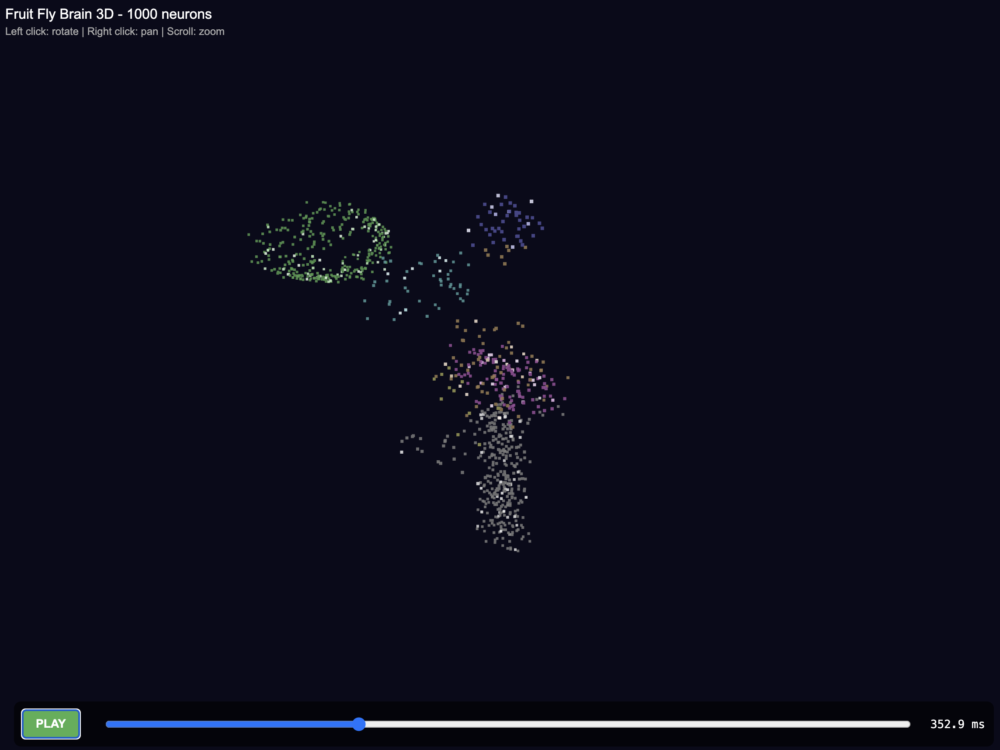

# Fruit Fly Brain Simulator

A C++ simulation of the fruit fly (Drosophila) brain connectome.

## Overview

This project simulates the neural dynamics of the fruit fly brain, which contains approximately 140,000 neurons connected by 50-80 million synapses.

### Features

- **Neuron Models**: Leaky integrate-and-fire (LIF) and adaptive neuron models
- **Synapse Models**: Chemical synapses with short-term plasticity and STDP
- **Brain Regions**: Optic lobe, mushroom body, central complex, antennal lobe, etc.
- **Parallel Simulation**: OpenMP-accelerated simulation
- **Synthetic Connectome Generation**: Realistic connectivity statistics

### Project Structure

```
brain_app/
├── include/
│   ├── neuron.hpp          # Neuron models
│   ├── synapse.hpp         # Synapse models
│   ├── brain_region.hpp    # Brain region organization
│   ├── connectome.hpp      # Connectome data structure
│   ├── simulator.hpp       # Main simulator
│   └── io_utils.hpp        # I/O utilities
├── src/
│   ├── neuron.cpp
│   ├── synapse.cpp
│   ├── brain_region.cpp
│   ├── connectome.cpp
│   ├── simulator.cpp
│   ├── io_utils.cpp
│   ├── main.cpp            # Main simulation executable
│   └── data_loader_main.cpp # Data loading utility
├── tests/
│   └── run_tests.cpp       # Unit tests
├── data/                    # Data files
├── docs/                    # Documentation
├── CMakeLists.txt
└── README.md
```

## Building

### Requirements

- C++17 compatible compiler (GCC 7+, Clang 5+)
- CMake 3.16+
- OpenMP (optional, for parallel simulation)

### Build Instructions

```bash
mkdir build && cd build
cmake ..
make -j4

# Run tests
./run_tests

# Run simulation
./brain_app --help
```

## Usage

### Basic Simulation

```bash
# Run with default parameters (1000 neurons, 1000ms)
./brain_app

# Generate synthetic connectome with 10000 neurons
./brain_app --neurons 10000 --time 5000 --synthetic

# Load connectome from file
./brain_app --input connectome.csv --time 10000

# Save spike data to file
./brain_app --synthetic --output spikes.csv

# Generate 3D visualization
./brain_app --neurons 1000 --synthetic --viz brain.html
```

### 3D Visualization

Open the generated HTML file in a web browser to view the 3D brain visualization:
- **Rotate**: Click and drag
- **Zoom**: Scroll wheel
- **Pan**: Right-click and drag

The visualization shows:
- Different brain regions in different colors
- Neuron positions based on anatomical layout
- (Optional) Spike animation if simulation data is available

### Command Line Options

| Option | Description | Default |
|--------|-------------|---------|
| `-n, --neurons <N>` | Number of neurons | 1000 |
| `-t, --time <ms>` | Simulation duration (ms) | 1000 |
| `-d, --dt <ms>` | Time step (ms) | 0.1 |
| `-s, --seed <N>` | Random seed | 42 |
| `--synthetic` | Generate synthetic connectome | false |
| `--no-parallel` | Disable parallel execution | false |
| `-o, --output <file>` | Output file for spike data | - |
| `--viz <file>` | Generate 3D visualization HTML | - |
| `--export <file>` | Export connectome as CSV | - |

### Data Loader Utility

```bash
# Generate synthetic connectome and save to file
./data_loader generate 10000 connectome.csv 0.01

# Show statistics from existing connectome
./data_loader stats connectome.csv
```

## Scientific Background

### Fruit Fly Brain Anatomy

The fruit fly brain consists of several major regions:

| Region | Function | Neuron Count |
|--------|----------|--------------|
| Optic Lobe | Visual processing | ~50,000 |
| Antennal Lobe | Olfactory processing | ~900 |
| Mushroom Body | Learning & memory | ~2,500 |
| Central Complex | Navigation & motor control | ~1,500 |
| Lateral Horn | Innate behaviors | ~1,000 |
| Subesophageal Zone | Feeding & taste | ~10,000 |
| Ventral Nerve Cord | Motor output | ~15,000 |

### Neuron Model

The default neuron model is a leaky integrate-and-fire (LIF) model:

```
τ_m * dV/dt = (E_L - V) + I * R
```

Where:
- `τ_m` = membrane time constant (20 ms)
- `E_L` = resting potential (-65 mV)
- `V` = membrane potential
- `I` = input current
- `R` = membrane resistance

### Synapse Model

Chemical synapses use an alpha-function conductance model:

```
I_syn = g_syn * (V - E_rev)
```

With short-term plasticity:
- **Facilitation**: Increased release probability after spikes
- **Depression**: Depletion of neurotransmitter vesicles

## Data Sources

Connectome data can be obtained from:

- **neuPrint**: https://neuprint.janelia.org/
- **FlyEM Hemibrain**: https://www.janelia.org/project-team/flyem/hemibrain
- **Whole Brain Connectome**: Scheffer et al., 2020 (Cell)

## Screenshot



## References

1. Scheffer, L.K., et al. (2020). A Connectome and a Taxonomy of Neurons for the Whole Fruit Fly Brain. *Cell*, 181(7), 1612-1631.
2. Zheng, Z., et al. (2018). A Complete Electron Microscopy Volume of the Brain of Adult Drosophila melanogaster. *Cell*, 174(3), 730-743.
3. Janelia Research Campus. FlyEM Hemibrain Dataset. https://doi.org/10.25378/janelia.12522689

## License

MIT License
